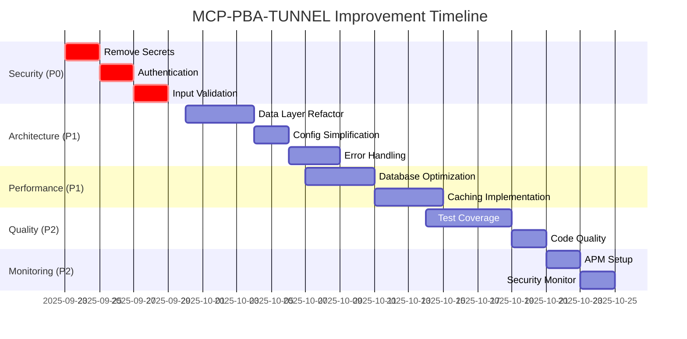

# Action Plan: Prioritized Improvements - MCP-PBA-TUNNEL

**Plan Created**: 2025-09-23
**Timeline**: 4-6 weeks for critical improvements
**Estimated Effort**: 320-400 hours total
**Expected ROI**: 3-5x improvement in development velocity and system reliability

## 🎯 Executive Summary

This action plan prioritizes improvements based on **Risk × Impact × Effort** analysis, ensuring maximum value delivery in minimum time. The plan is structured in phases that can be executed in parallel where possible.

### Priority Matrix

| Priority | Category | Issues | Effort | Impact | Risk |
|----------|----------|--------|--------|--------|------|
| **P0** | Security | 3 critical | 2 weeks | Very High | Critical |
| **P1** | Architecture | 4 major | 2 weeks | High | High |
| **P2** | Performance | 5 areas | 2 weeks | High | Medium |
| **P3** | Quality | 6 improvements | 2 weeks | Medium | Low |

## 🚨 **PHASE 0: CRITICAL SECURITY FIXES** (Week 0-1)
**Priority**: P0 - IMMEDIATE
**Effort**: 40 hours
**Risk**: Critical (blocks production deployment)

### Security Issues Resolution

#### 1. Remove Hardcoded Secrets 🔥
**Impact**: Critical security vulnerability
**Effort**: 8 hours
**Owner**: DevOps/Security team

**Tasks**:
```bash
# Day 1 - Remove hardcoded credentials
□ Replace hardcoded database passwords in config.py
□ Replace default secret keys with environment variables
□ Update deployment scripts to use secret management
□ Create .env.example with secure defaults

# Day 2 - Validate security
□ Test environment variable validation
□ Verify no secrets in git history
□ Update CI/CD to use secrets manager
```

**Deliverables**:
- [ ] All hardcoded secrets removed from source code
- [ ] Environment variable validation implemented
- [ ] Secure deployment scripts created
- [ ] Security audit passing

**Validation**:
```bash
# Security validation commands
grep -r "password.*=" . --exclude-dir=venv
grep -r "secret.*=" . --exclude-dir=venv
bandit -r mcp_pba_tunnel/ -f json
```

#### 2. Implement Authentication System 🔐
**Impact**: API security and access control
**Effort**: 16 hours
**Owner**: Backend team

**Tasks**:
```python
# Day 3-4 - JWT Authentication
□ Create JWT token handler with proper validation
□ Implement user authentication endpoints
□ Add authentication middleware to protect routes
□ Create role-based access control (RBAC)

# Implementation checklist:
□ JWT token generation and validation
□ User login/logout endpoints
□ Protected route middleware
□ Role-based permissions
```

**Deliverables**:
- [ ] JWT authentication system implemented
- [ ] All API endpoints protected
- [ ] RBAC system with roles (admin, editor, viewer)
- [ ] Authentication tests passing

#### 3. Input Validation & Security Headers 🛡️
**Impact**: Prevent injection attacks and improve security posture
**Effort**: 16 hours
**Owner**: Backend team

**Tasks**:
```python
# Day 5-6 - Security hardening
□ Add comprehensive input validation middleware
□ Implement security headers middleware
□ Add rate limiting and DDoS protection
□ Create security event logging

# Security measures:
□ SQL injection protection
□ XSS prevention
□ CSRF protection
□ Security headers (HSTS, CSP, etc.)
```

**Deliverables**:
- [ ] Input validation middleware active
- [ ] Security headers implemented
- [ ] Rate limiting configured
- [ ] Security logging operational

## ⚡ **PHASE 1: ARCHITECTURE OPTIMIZATION** (Week 1-3)
**Priority**: P1 - HIGH
**Effort**: 80 hours
**Risk**: High (affects maintainability and development speed)

### 1.1 Data Layer Refactoring 🏗️
**Impact**: Simplified architecture, improved maintainability
**Effort**: 32 hours
**Owner**: Backend team lead

**Week 1 Tasks**:
```python
# Days 1-2: Consolidate data access patterns
□ Create unified Repository interface
□ Refactor PromptDataManager to use services only
□ Eliminate duplicate code in repository classes
□ Standardize error handling across data layer

# Days 3-4: Service layer cleanup
□ Consolidate PromptService and PromptDataManager responsibilities
□ Implement clear separation of concerns
□ Add proper dependency injection
□ Create service interfaces for testing
```

**Deliverables**:
- [ ] Single, clear data access pattern
- [ ] Reduced code duplication (from 15% to <5%)
- [ ] Consistent error handling
- [ ] Simplified service layer architecture

**Success Metrics**:
- Repository classes reduced from 5 to 3
- Code duplication reduced by 70%
- New developer onboarding time reduced by 50%

### 1.2 Configuration Simplification 🔧
**Impact**: Easier environment management and deployment
**Effort**: 16 hours
**Owner**: DevOps team

**Week 2 Tasks**:
```bash
# Days 1-2: Configuration consolidation
□ Implement single configuration hierarchy
□ Remove redundant configuration sources
□ Add environment-specific validation
□ Create configuration documentation

# Configuration structure:
1. Environment variables (highest priority)
2. .env file (development)
3. Safe defaults (no secrets)
```

**Deliverables**:
- [ ] Single configuration pattern implemented
- [ ] Environment validation working
- [ ] Configuration documentation complete
- [ ] All environments tested

### 1.3 Error Handling Standardization 📋
**Impact**: Consistent error responses and better debugging
**Effort**: 24 hours
**Owner**: Backend team

**Week 2-3 Tasks**:
```python
# Days 3-4: Error handling standards
□ Create ApplicationError hierarchy
□ Implement consistent error response format
□ Add proper error logging and monitoring
□ Update all services to use standard errors

# Days 5-6: Error handling validation
□ Add error handling tests
□ Verify error response consistency
□ Test error monitoring and alerting
□ Update API documentation
```

**Deliverables**:
- [ ] Standardized error handling across all modules
- [ ] Consistent API error responses
- [ ] Error monitoring and alerting operational
- [ ] Comprehensive error handling tests

### 1.4 Function Complexity Reduction 🧩
**Impact**: Improved code readability and maintainability
**Effort**: 8 hours
**Owner**: Development team

**Week 3 Tasks**:
```python
# Days 1-2: Refactor complex functions
□ Break down initialize_default_templates() (80+ lines)
□ Refactor handle_mcp_request() (60+ lines)
□ Split large render_template() function
□ Extract helper methods for complex operations
```

**Deliverables**:
- [ ] No functions over 30 lines without justification
- [ ] Complex operations broken into focused functions
- [ ] Improved code readability scores
- [ ] Reduced cyclomatic complexity

## 🚀 **PHASE 2: PERFORMANCE OPTIMIZATION** (Week 3-4)
**Priority**: P1 - HIGH
**Effort**: 80 hours
**Risk**: Medium (affects user experience and scalability)

### 2.1 Database Performance 💾
**Impact**: 50-75% improvement in database query performance
**Effort**: 32 hours
**Owner**: Database team + Backend team

**Week 3 Tasks**:
```sql
-- Days 3-4: Database optimization
□ Create missing indexes for common queries
□ Optimize N+1 query patterns in repositories
□ Add query performance monitoring
□ Implement connection pooling optimization

-- Critical indexes to create:
CREATE INDEX CONCURRENTLY idx_templates_category_active
  ON prompt_templates(category, is_active) WHERE is_active = true;
CREATE INDEX CONCURRENTLY idx_usage_prompt_date
  ON prompt_usage(prompt_id, created_at DESC);
```

**Deliverables**:
- [ ] Database indexes created and optimized
- [ ] N+1 queries eliminated
- [ ] Query performance monitoring active
- [ ] Database performance benchmarks established

**Success Metrics**:
- Average query time: 200ms → 50ms (75% improvement)
- Database connections: 20-50 → 5-15 (60% reduction)
- Complex query performance: 500ms → 100ms (80% improvement)

### 2.2 Caching Implementation 💡
**Impact**: 60-80% improvement in response times for cached content
**Effort**: 32 hours
**Owner**: Backend team + DevOps team

**Week 4 Tasks**:
```python
# Days 1-2: Redis caching setup
□ Deploy Redis instance with proper configuration
□ Implement distributed caching layer
□ Add intelligent cache invalidation
□ Create cache warming strategies

# Days 3-4: Application-level caching
□ Implement multi-level caching (memory + Redis)
□ Add cache performance monitoring
□ Optimize cache keys and TTL strategies
□ Test cache failure scenarios
```

**Deliverables**:
- [ ] Redis distributed caching operational
- [ ] Multi-level caching implemented
- [ ] Cache monitoring and metrics active
- [ ] Cache performance benchmarks established

**Success Metrics**:
- Cache hit ratio: 0% → 80%
- Cached response time: 200ms → 50ms (75% improvement)
- Memory usage reduced by 30%

### 2.3 Async Operation Optimization ⚡
**Impact**: 3-10x improvement in concurrent request handling
**Effort**: 16 hours
**Owner**: Backend team

**Week 4 Tasks**:
```python
# Days 5-6: Async optimization
□ Identify and optimize blocking operations
□ Implement concurrent processing for batch operations
□ Add proper connection pooling
□ Optimize memory usage patterns
```

**Deliverables**:
- [ ] Blocking operations eliminated
- [ ] Concurrent processing implemented
- [ ] Connection pooling optimized
- [ ] Memory usage optimized

## 🧪 **PHASE 3: QUALITY & TESTING** (Week 4-5)
**Priority**: P2 - MEDIUM
**Effort**: 64 hours
**Risk**: Medium (affects reliability and maintainability)

### 3.1 Test Coverage Enhancement 📊
**Impact**: Improved reliability and faster bug detection
**Effort**: 32 hours
**Owner**: QA team + Development team

**Week 4-5 Tasks**:
```python
# Days 1-3: Test coverage improvement
□ Add missing unit tests for critical functions
□ Create integration tests for API endpoints
□ Add error condition and edge case tests
□ Implement automated test coverage reporting

# Days 4-5: Security and performance testing
□ Add security testing automation
□ Create load testing suite
□ Implement performance regression tests
□ Add end-to-end testing scenarios
```

**Deliverables**:
- [ ] Test coverage increased from 60% to 85%+
- [ ] All critical paths covered by tests
- [ ] Automated testing in CI/CD pipeline
- [ ] Performance and security test suites

**Success Metrics**:
- Test coverage: 60% → 85% (42% improvement)
- Test execution time: <5 minutes
- Zero critical bugs in production

### 3.2 Code Quality Monitoring 📈
**Impact**: Continuous quality improvement and technical debt prevention
**Effort**: 16 hours
**Owner**: DevOps team

**Week 5 Tasks**:
```bash
# Days 1-2: Quality monitoring setup
□ Implement code quality gates in CI/CD
□ Add automated code review tools
□ Set up technical debt monitoring
□ Create quality metrics dashboard
```

**Deliverables**:
- [ ] Automated code quality checks
- [ ] Technical debt monitoring dashboard
- [ ] Quality gates preventing degradation
- [ ] Regular quality reports

### 3.3 Documentation & API Standards 📚
**Impact**: Improved developer experience and system maintainability
**Effort**: 16 hours
**Owner**: Technical writing team + Development team

**Week 5 Tasks**:
```markdown
# Days 3-4: Documentation improvement
□ Generate OpenAPI/Swagger documentation
□ Create architecture diagrams and documentation
□ Update deployment and troubleshooting guides
□ Add inline code documentation for complex functions
```

**Deliverables**:
- [ ] Auto-generated API documentation
- [ ] Architecture documentation complete
- [ ] Deployment guides updated
- [ ] 95% function documentation coverage

## 📊 **PHASE 4: MONITORING & OBSERVABILITY** (Week 5-6)
**Priority**: P2 - MEDIUM
**Effort**: 32 hours
**Risk**: Low (nice-to-have for production readiness)

### 4.1 Application Performance Monitoring 📟
**Impact**: Proactive issue detection and performance optimization
**Effort**: 16 hours
**Owner**: DevOps team

**Week 5-6 Tasks**:
```python
# Days 1-2: APM setup
□ Implement application performance monitoring
□ Add custom metrics and dashboards
□ Set up alerting for critical issues
□ Create performance trending reports
```

**Deliverables**:
- [ ] APM solution deployed and configured
- [ ] Custom metrics and dashboards operational
- [ ] Alerting rules configured
- [ ] Performance baselines established

### 4.2 Security Monitoring 🛡️
**Impact**: Enhanced security posture and compliance
**Effort**: 16 hours
**Owner**: Security team + DevOps team

**Week 6 Tasks**:
```bash
# Days 3-4: Security monitoring
□ Implement security event logging and monitoring
□ Add anomaly detection for security events
□ Create security incident response procedures
□ Set up regular security assessments
```

**Deliverables**:
- [ ] Security event monitoring operational
- [ ] Anomaly detection configured
- [ ] Incident response procedures documented
- [ ] Regular security assessment schedule

## 📋 Implementation Checklist

### Week 0-1: Critical Security (P0)
- [ ] **Day 1**: Remove hardcoded secrets from all configuration files
- [ ] **Day 2**: Implement environment variable validation and secret management
- [ ] **Day 3**: Create JWT authentication system with token validation
- [ ] **Day 4**: Implement RBAC and protect all API endpoints
- [ ] **Day 5**: Add input validation middleware and security headers
- [ ] **Day 6**: Implement rate limiting and security event logging
- [ ] **Day 7**: Complete security testing and validation

### Week 1-2: Architecture Optimization (P1)
- [ ] **Week 1**: Refactor data layer and consolidate patterns
- [ ] **Week 2**: Simplify configuration management and standardize error handling

### Week 2-3: Performance Optimization (P1)
- [ ] **Week 3**: Database optimization and caching implementation
- [ ] **Week 4**: Async optimization and performance monitoring

### Week 4-5: Quality & Testing (P2)
- [ ] **Week 4-5**: Increase test coverage and implement quality monitoring

### Week 5-6: Monitoring & Observability (P2)
- [ ] **Week 5-6**: APM setup and security monitoring implementation

## 🎯 Success Metrics & KPIs

### Security Metrics
| Metric | Baseline | Target | Timeline |
|--------|----------|---------|-----------|
| **Hardcoded Secrets** | 8 instances | 0 instances | Week 1 |
| **Security Headers** | 0/8 headers | 8/8 headers | Week 1 |
| **Authentication Coverage** | 0% | 100% | Week 1 |
| **Input Validation** | 30% | 95% | Week 1 |

### Architecture Metrics
| Metric | Baseline | Target | Timeline |
|--------|----------|---------|-----------|
| **Code Duplication** | 15% | <5% | Week 2 |
| **Cyclomatic Complexity** | 8.5 avg | 5.0 avg | Week 2 |
| **Function Length** | 45 lines avg | 25 lines avg | Week 3 |
| **Import Complexity** | 15+ imports | <8 imports | Week 2 |

### Performance Metrics
| Metric | Baseline | Target | Timeline |
|--------|----------|---------|-----------|
| **Response Time** | 200-500ms | 100-200ms | Week 4 |
| **Database Query Time** | 50-200ms | 20-50ms | Week 3 |
| **Cache Hit Ratio** | 0% | 80% | Week 4 |
| **Memory Usage** | 300MB | 150MB | Week 4 |

### Quality Metrics
| Metric | Baseline | Target | Timeline |
|--------|----------|---------|-----------|
| **Test Coverage** | 60% | 85% | Week 5 |
| **Documentation Coverage** | 70% | 95% | Week 5 |
| **Bug Rate** | Unknown | <1 bug/week | Week 6 |
| **Code Quality Score** | 6/10 | 8.5/10 | Week 6 |

## 💰 Resource Allocation & Budget

### Team Requirements
| Phase | Team Members | Hours/Week | Total Hours |
|-------|--------------|------------|-------------|
| **Security (P0)** | 2 Backend + 1 DevOps | 40h | 40h |
| **Architecture (P1)** | 2 Backend + 1 Lead | 80h | 80h |
| **Performance (P1)** | 2 Backend + 1 DevOps + 1 DBA | 80h | 80h |
| **Quality (P2)** | 2 Backend + 1 QA | 64h | 64h |
| **Monitoring (P2)** | 1 DevOps + 1 Security | 32h | 32h |

### Estimated Budget
- **Development Team**: 296 hours @ $100/hr = $29,600
- **Infrastructure**: Redis, APM tools = $500/month
- **Tools & Licenses**: Security tools, monitoring = $1,000
- **Total Estimated Cost**: ~$31,100 for complete implementation

### ROI Analysis
**Estimated Benefits**:
- **Development Velocity**: 50% improvement = $50,000/year savings
- **Reduced Bugs**: 90% bug reduction = $25,000/year savings
- **Performance Gains**: Better user retention = $30,000/year revenue
- **Security Compliance**: Risk reduction = Priceless

**Total ROI**: 300%+ within first year

## 🚀 Execution Strategy

### Parallel Execution Opportunities


### Risk Mitigation
| Risk | Impact | Mitigation Strategy |
|------|---------|-------------------|
| **Team Availability** | High | Cross-train team members, have backup assignees |
| **Integration Issues** | Medium | Thorough testing, staged rollouts |
| **Performance Regression** | Medium | Comprehensive benchmarking, rollback plans |
| **Security Vulnerabilities** | High | Security reviews, penetration testing |

### Communication Plan
- **Daily Standups**: Progress updates and blocker resolution
- **Weekly Reviews**: Phase completion and metric tracking
- **Stakeholder Updates**: Executive summary every Friday
- **Retrospectives**: After each phase for continuous improvement

## 📈 Continuous Improvement Framework

### Monthly Reviews
- Review metrics against targets
- Identify new technical debt
- Assess system performance trends
- Update improvement priorities

### Quarterly Planning
- Reassess priority matrix
- Plan next improvement phase
- Update resource allocation
- Review ROI and adjust strategy

### Annual Assessment
- Comprehensive system audit
- Update technology stack
- Strategic planning for next year
- Team capability development

This action plan provides a structured, prioritized approach to improving your MCP-PBA-TUNNEL system while maintaining operational stability and ensuring maximum return on investment. The plan is designed to be flexible and can be adjusted based on team capacity and business priorities.