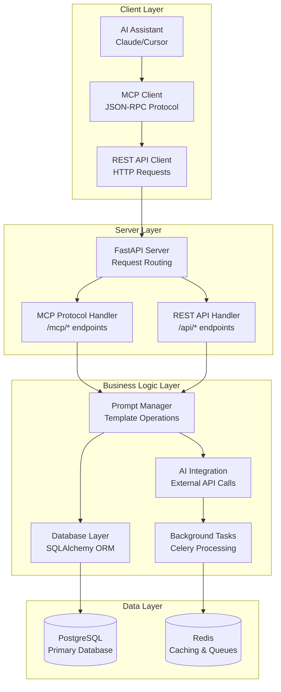

# MCP Prompt Engineering Server Architecture

This project implements a FastAPI-based Model Context Protocol (MCP) server for standardized prompt engineering templates and AI agent integration, providing a flexible architecture for AI-assisted development workflows.

## Core Architecture Components

### FastAPI MCP Server

- **Main Server** (`mcp_pba_tunnel/server/fastapi_mcp_server.py`): FastAPI-based MCP server with async support
- **MCP Protocol Handler**: Implements MCP 2024-11-05 specification
- **REST API Layer**: Additional REST endpoints for management and integration
- **Background Tasks**: Celery-based async processing for AI operations

### Data Management Layer

- **Database Manager** (`mcp_pba_tunnel/data/project_manager.py`): SQLAlchemy-based ORM with PostgreSQL
- **Prompt Manager**: Business logic for prompt template management
- **Data Models**: SQLAlchemy models for prompts, usage tracking, and AI configurations
- **Migration System**: Alembic-based database migrations

### AI Integration Layer

- **Prompt Templates**: Standardized templates for different development tasks
- **AI Model Support**: Integration with OpenAI, Anthropic, and other providers
- **Usage Tracking**: Comprehensive analytics and performance monitoring
- **Caching System**: Redis-based caching for frequently used templates

## Request Flow Architecture

## Data Flow

1. **Client Request**: AI assistant or MCP client sends MCP protocol request
2. **Protocol Processing**: FastAPI server routes request to appropriate handler
3. **Template Resolution**: System loads and processes prompt templates from database
4. **Variable Substitution**: Template variables are replaced with actual values
5. **AI Processing**: Optional AI model integration for template enhancement
6. **Response Generation**: Server returns processed prompt or generated content

## Key Features

- **FastAPI Framework**: High-performance async web framework
- **MCP Protocol Compliance**: Full implementation of MCP 2024-11-05 specification
- **Database-Driven Templates**: SQLAlchemy-based prompt template storage
- **Multi-Model AI Support**: Integration with GPT-4, Claude, and other models
- **Background Processing**: Celery-based async task processing
- **Comprehensive Monitoring**: Health checks, metrics, and logging
- **Docker Support**: Containerized deployment ready

## Development Workflow

1. **Environment Setup**: Python 3.11+, virtual environment, dependencies
2. **Database Initialization**: SQLAlchemy models and initial data
3. **Server Development**: FastAPI development with hot reload
4. **Template Management**: Create and test prompt templates
5. **AI Integration**: Configure and test AI model connections
6. **Testing & Deployment**: Unit tests, integration tests, production deployment

## Technology Stack

### Core Framework

- **FastAPI**: High-performance async web framework
- **Uvicorn**: ASGI server for production
- **Gunicorn**: WSGI server for production deployment
- **Pydantic**: Data validation and serialization

### Database & Storage

- **SQLAlchemy 2.0**: ORM and database toolkit
- **PostgreSQL**: Primary database (development and production)
- **Alembic**: Database migrations
- **Redis**: Caching and background task queue

### AI & External Services

- **OpenAI SDK**: GPT-4 and GPT-3.5 integration
- **Anthropic SDK**: Claude model integration
- **HTTPX**: Async HTTP client for API calls

### Development & Quality

- **Ruff**: Fast Python linter and formatter
- **MyPy**: Static type checking
- **Pytest**: Testing framework with async support
- **Celery**: Background task processing

### Deployment & Monitoring

- **Docker**: Containerization
- **Health Checks**: Built-in health monitoring
- **Structured Logging**: JSON logging format
- **Metrics Collection**: Request/response metrics
