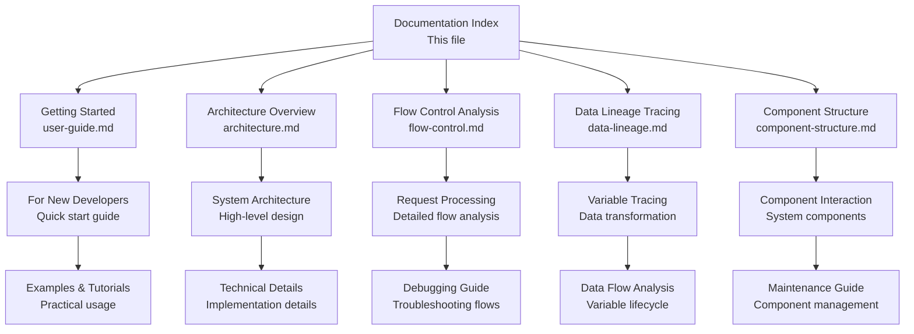

# 📚 MCP-PBA-TUNNEL Documentation

## 🎯 Welcome to the Documentation

This is the comprehensive documentation for the **MCP-PBA-TUNNEL** - a FastAPI-based MCP server for standardized prompt engineering templates and AI agent integration.

## 📋 Documentation Structure



## 🚀 Quick Start Guides

### For New Users

- **[User Guide](user-guide.md)** - Complete guide for new developers
  - Setup instructions
  - Basic usage examples
  - Troubleshooting guide
  - Best practices

### For Developers

- **[Architecture Overview](architecture.md)** - System design and components
  - High-level architecture
  - Component relationships
  - Deployment patterns
  - Future enhancements

## 🔍 Technical Documentation

### System Analysis

- **[Flow Control](flow-control.md)** - Request processing analysis
  - HTTP request lifecycle
  - Error handling flow
  - Performance optimization
  - Control flow branching

### Data Management

- **[Data Lineage](data-lineage.md)** - Variable tracing and transformation
  - Variable lifecycle analysis
  - Data transformation points
  - Quality metrics
  - Governance policies

### Component Architecture

- **[Component Structure](component-structure.md)** - Service architecture
  - Component dependencies
  - Interaction patterns
  - Quality metrics
  - Performance components

## 📊 Documentation Categories

### 🎓 **Beginner-Friendly**

| Document | Description | Audience |
|----------|-------------|----------|
| [User Guide](user-guide.md) | Complete getting started guide | New users, developers |
| [Architecture Overview](architecture.md) | High-level system understanding | Technical users |

### 🔧 **Technical Deep-Dive**

| Document | Description | Audience |
|----------|-------------|----------|
| [Flow Control](flow-control.md) | Request processing analysis | Developers, architects |
| [Data Lineage](data-lineage.md) | Data transformation tracing | Data engineers, developers |
| [Component Structure](component-structure.md) | Component architecture | System architects, developers |

### 📈 **Advanced Topics**

| Document | Description | Audience |
|----------|-------------|----------|
| [Architecture](architecture.md) | System design patterns | System architects |
| [Flow Control](flow-control.md) | Performance optimization | Performance engineers |

## 🎯 Documentation by Use Case

### **I want to manage prompt templates**

1. Start with [User Guide](user-guide.md)
2. Follow the quick start instructions
3. Try the examples in the guide
4. Check troubleshooting if you run into issues

### **I want to understand how it works**

1. Read [Architecture Overview](architecture.md)
2. Review [Component Structure](component-structure.md)
3. Examine [Flow Control](flow-control.md) for request processing

### **I want to contribute or extend the system**

1. Study all technical documentation
2. Understand [Data Lineage](data-lineage.md) for data handling
3. Review component interactions in [Component Structure](component-structure.md)

### **I want to deploy or scale the system**

1. Check deployment patterns in [Architecture](architecture.md)
2. Review performance components in [Component Structure](component-structure.md)
3. Understand monitoring setup

## 📁 File Organization

```
documents/
├── README.md              # This index file
├── user-guide.md         # Getting started guide
├── architecture.md       # System architecture
├── flow-control.md       # Request flow analysis
├── data-lineage.md       # Data transformation tracing
├── component-structure.md # Component architecture
├── design-patterns.md    # Design pattern implementations
├── alembic-guide.md      # Database migration guide
├── developer-conduct.md  # Developer guidelines and standards
└── aws-deployment.md     # AWS Lambda & API Gateway deployment
```

## 🔗 Related Documentation

### Project Files

- **`README.md`** (root) - Quick start and overview
- **`docs/README.md`** - Detailed usage documentation
- **`config/mcp_config.json`** - Server configuration
- **`templates/`** - Framework template examples

### External Resources

- [FastAPI Documentation](https://fastapi.tiangolo.com/) - FastAPI framework documentation
- [MCP Protocol Specification](https://modelcontextprotocol.io/) - MCP standards
- [Framework Documentation](#frameworks) - Individual framework docs

## 📖 Reading Guide

### Sequential Reading (Recommended)

1. **[User Guide](user-guide.md)** - Learn the basics
2. **[Architecture Overview](architecture.md)** - Understand the system
3. **[Flow Control](flow-control.md)** - Learn request processing
4. **[Data Lineage](data-lineage.md)** - Understand data handling
5. **[Component Structure](component-structure.md)** - Deep technical details

### Topic-Based Reading

- **New to the project?** → [User Guide](user-guide.md)
- **Need to understand the system?** → [Architecture](architecture.md)
- **Debugging an issue?** → [Flow Control](flow-control.md)
- **Working with data?** → [Data Lineage](data-lineage.md)
- **Extending the system?** → [Component Structure](component-structure.md)

## 🎨 Documentation Features

### Visual Elements

- **Mermaid Diagrams** - System architecture and flow visualization
- **Code Examples** - Practical implementation examples
- **Tables** - Structured information presentation
- **Flowcharts** - Process and data flow visualization

### Interactive Elements

- **Quick Start Examples** - Copy-paste ready commands
- **Troubleshooting Guide** - Common issues and solutions
- **Best Practices** - Recommended approaches
- **Configuration Examples** - Real configuration files

## 🔄 Updates and Maintenance

### Documentation Status

- ✅ **User Guide** - Complete and up-to-date
- ✅ **Architecture** - Complete with diagrams
- ✅ **Flow Control** - Complete with detailed analysis
- ✅ **Data Lineage** - Complete with tracing examples
- ✅ **Component Structure** - Complete with component details

### Contributing to Documentation

1. Follow the existing structure and style
2. Add Mermaid diagrams for complex concepts
3. Include practical examples
4. Update this index when adding new documents
5. Test documentation with new users

## 📞 Getting Help

### Support Channels

1. **Documentation Issues** - Create GitHub issues for documentation problems
2. **Technical Questions** - Use GitHub discussions
3. **Bug Reports** - Submit detailed bug reports with reproduction steps

### Help Resources

- **Examples Directory** - `templates/` contains working examples
- **Configuration Files** - `config/` has example configurations
- **Test Files** - Look for test files to understand expected behavior

## 🎯 Key Takeaways

### What You'll Learn

- How to manage prompt templates with FastAPI-based MCP server
- How the MCP system processes prompt requests
- How data flows through the prompt engineering pipeline
- How components interact for template management
- How to extend and customize the prompt system

### What You'll Be Able To Do

- Generate standardized prompt templates for AI agents
- Understand and debug the prompt engineering system
- Extend the system with new prompting techniques
- Contribute to the project's development
- Help other developers implement advanced prompting

---

**Happy learning! 📖**

This documentation is designed to be comprehensive yet accessible, helping both new users and experienced developers understand and work with the MCP-PBA-TUNNEL system.
