# 🏗️ MCP-PBA-TUNNEL - Architecture Overview

## 📋 Overview

MCP-PBA-TUNNEL (MCP Prompt-Based Architecture Tunnel) is a sophisticated FastAPI-based Model Context Protocol (MCP) server that provides standardized prompt engineering templates and AI agent integration, enabling consistent, high-quality development workflows across your organization.

## 🎯 Core System Architecture

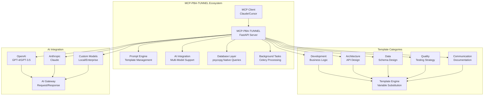

## 🔧 Component Architecture

### 1. FastAPI MCP Server (`mcp_pba_tunnel/server/fastapi_mcp_server.py`)

The core FastAPI-based MCP server implementation that handles all prompt template requests and manages AI integration for prompt engineering, now enhanced with advanced tool capabilities.

**Key Components:**

- **Main Application**: FastAPI server handling MCP protocol and REST API requests
- **Request Handlers**: Route handlers for MCP and REST endpoints
- **Enhanced Tool Integration**: Advanced tools including web scraping, code analysis, terminal execution
- **Data Manager Integration**: Uses the refactored repository/service layer with enhanced memory
- **Background Tasks**: Celery integration for async processing
- **Advanced Reasoning**: Multi-step reasoning chains and context-aware planning tools

### 2. Data Models Layer (`mcp_pba_tunnel/data/models/`)

Pydantic-based data models providing type safety and validation throughout the system.

**Components:**

- **Base Models**: Core data structures with validation
- **DTOs**: Data Transfer Objects for API communication
- **Domain Models**: Business domain representations
- **Validation**: Automatic data validation and sanitization

### 3. Repository Layer (`mcp_pba_tunnel/data/repositories/`)

Database operations layer implementing the Repository pattern for clean data access.

**Components:**

- **DatabaseConfig**: Connection pooling and transaction management
- **BaseRepository**: Generic CRUD operations for all entities
- **PromptTemplateRepository**: Prompt template database operations
- **AIConfigurationRepository**: AI model configuration storage
- **Connection Management**: psycopg native queries with pooling

### 4. Service Layer (`mcp_pba_tunnel/data/services/`)

Business logic layer implementing use cases and application rules.

**Components:**

- **PromptService**: Prompt template business logic and validation
- **AIService**: AI configuration and integration logic
- **ValidationService**: Data validation utilities
- **Business Rules**: Domain-specific logic and constraints

### 5. Enhanced Memory System (`mcp_pba_tunnel/data/models/prompt_models.py`)

Sophisticated context management with relationships and importance scoring.

**Features:**

- **Context Relationships**: Link memory entries with importance-based relationships
- **Importance Scoring**: Weighted memory entries for context-aware retrieval
- **Tag-Based Organization**: Flexible categorization and filtering system
- **Metadata Enrichment**: Rich context data with timestamps and source tracking
- **Context Types**: Support for different memory categories (conversation, task, reference)

**Enhanced Memory Models:**

- **ContextRelationship**: Models relationships between memory entries
- **ContextType**: Enumeration for different memory categories
- **EnhancedMemoryEntry**: Advanced memory entry with importance scoring and tags

### 6. Advanced Tool Components

#### Web Scraping & API Integration

- **BeautifulSoup4**: HTML/XML parsing and data extraction
- **Requests/httpx**: HTTP client for API interactions
- **Data Processing**: JSON, XML, and structured data handling

#### Code Analysis Tools

- **Complexity Analysis**: Cyclomatic complexity, maintainability index
- **Code Quality Metrics**: Lines of code, duplication detection
- **Performance Analysis**: Execution time, memory usage tracking

#### Terminal Execution

- **Command Processing**: Safe command execution with timeouts
- **Environment Management**: Working directory and environment variable control
- **Output Capture**: Structured result handling and error management

#### Database Query & Analysis

- **Schema Analysis**: Table structure, relationships, and metadata extraction
- **Query Optimization**: Performance analysis and improvement suggestions
- **Data Profiling**: Statistics and pattern analysis

#### Testing & Validation Tools

- **Test Execution**: Automated test running with coverage reporting
- **Code Validation**: Linting, type checking, and security scanning
- **Performance Testing**: Load testing and benchmark analysis

### 7. Main Facade (`mcp_pba_tunnel/data/project_manager.py`)

Orchestrates the repository and service layers using the Facade pattern, now enhanced with advanced tool capabilities.

**Features:**

- **Template Management**: CRUD operations for prompt templates
- **Enhanced Memory Management**: Sophisticated context management with relationships
- **Usage Tracking**: Analytics and performance monitoring
- **Advanced Tool Integration**: Web scraping, code analysis, terminal execution
- **Project Management**: Task tracking, database tools, testing capabilities
- **AI Integration**: Connection to external AI services with advanced reasoning
- **Data Validation**: Input sanitization and validation
- **Migration Management**: Database schema evolution

**Supported Categories:**

- **Development**: Business logic and API design templates
- **Architecture**: System design and architecture templates
- **Data**: Database schema and data modeling templates
- **Quality**: Testing strategy and code quality templates
- **Communication**: Documentation and presentation templates
- **Techniques**: Advanced reasoning and planning templates

### 8. MCP Protocol Integration

Direct MCP protocol endpoints for AI assistants to interact with the prompt engineering system. No separate client needed - AI models can call the server endpoints directly.

## 🎯 Advanced Reasoning Architecture

### Context-Aware Planning System

The enhanced MCP-PBA-TUNNEL includes sophisticated reasoning capabilities:

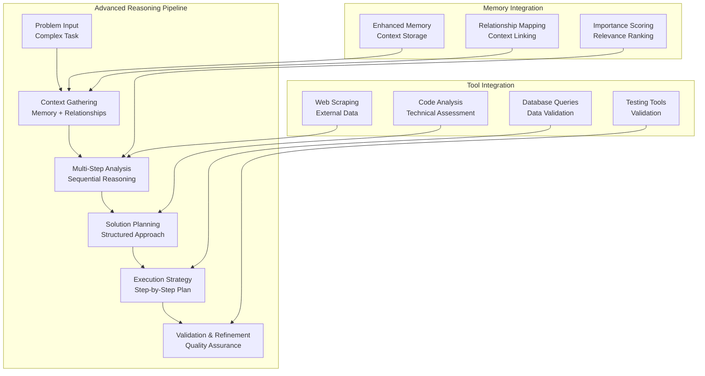

### Enhanced Tool Ecosystem

**Web Scraping & API Integration:**

- Real-time data fetching from external APIs
- HTML/XML parsing and structured data extraction
- API response processing and transformation
- Rate limiting and error handling

**Code Analysis & Quality:**

- Cyclomatic complexity analysis
- Maintainability index calculation
- Code duplication detection
- Performance profiling and optimization suggestions

**Database Tools:**

- Schema analysis and documentation
- Query performance optimization
- Data profiling and statistics
- Relationship mapping and dependency analysis

**Project Management:**

- Task breakdown and estimation
- Progress tracking and milestone management
- Resource allocation and scheduling
- Risk assessment and mitigation planning

## 🔒 Security Architecture

### Enhanced Security Model

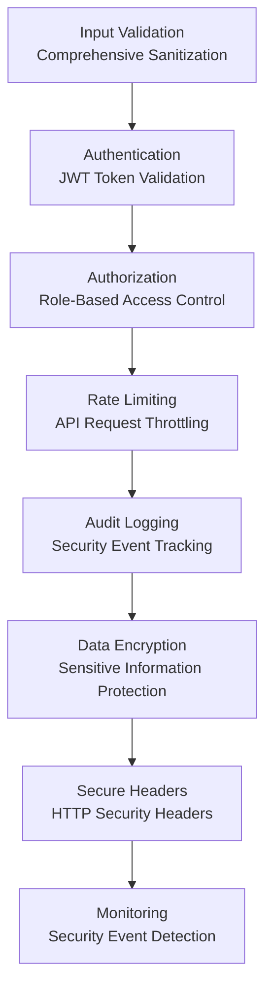

### Advanced Security Features

- **Enhanced Input Validation**: Multi-layer validation with sanitization
- **JWT Authentication**: Secure token-based authentication system
- **Role-Based Access Control**: Granular permission management
- **Rate Limiting**: Protection against abuse and DoS attacks
- **Audit Logging**: Comprehensive security event tracking
- **Data Encryption**: Encryption at rest and in transit
- **Security Headers**: HTTP security headers for web protection
- **Vulnerability Scanning**: Automated security vulnerability detection

## 🔄 Request Flow Architecture

### New Layered Architecture Flow

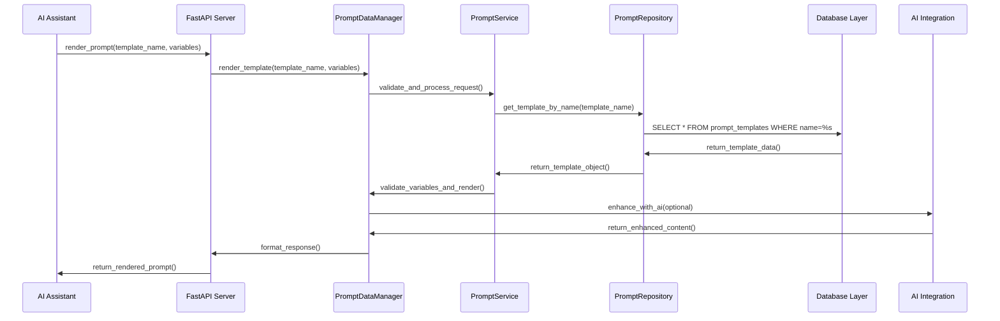

### Layer Interaction Overview

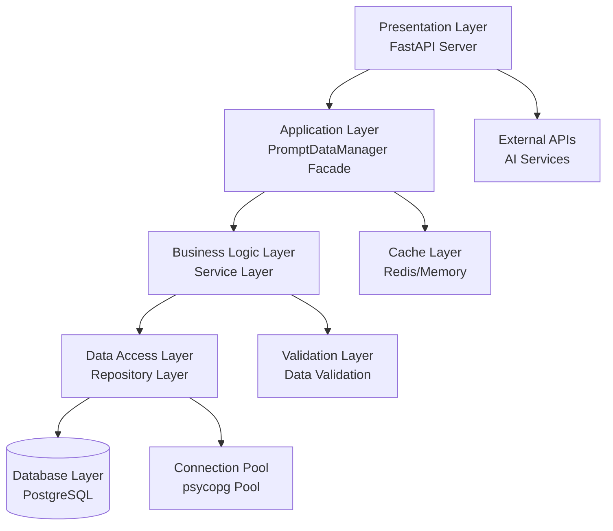

## 📊 Data Flow Architecture

### Prompt Template Processing Data Flow

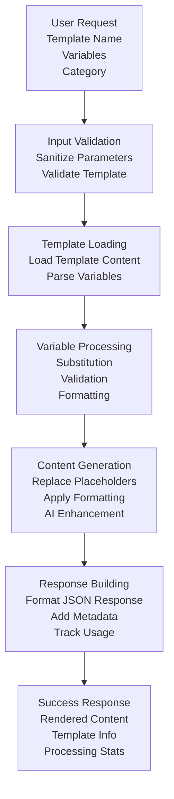

### Data Lineage - Template Variable Flow

**Example: How `template_name` flows through the system**

```mermaid
flowchart LR
    A[Client Input<br/>template_name="business_logic"] --> B[MCP Server<br/>Request Parsing]
    B --> C[Prompt Manager<br/>Template Resolution]
    C --> D[Template Variables<br/>{{business_domain}} → "e-commerce"]
    D --> E[Content Rendering<br/>Replace Variables<br/>Format Output]
    E --> F[Response Structure<br/>JSON Response<br/>with rendered content]
```

## 🏛️ Component Structure

### Layered Architecture Components

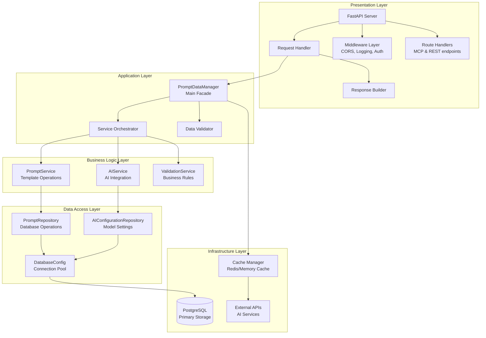

### Prompt Template Structure

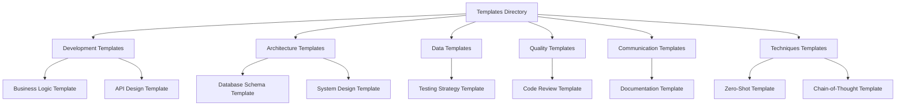

## 🔐 Security Architecture

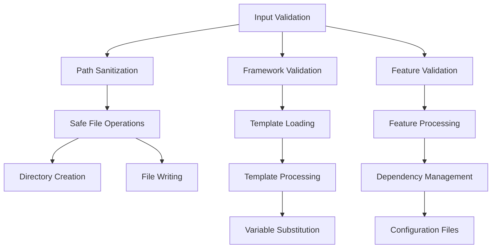

## 📈 Performance Architecture

### Caching Strategy

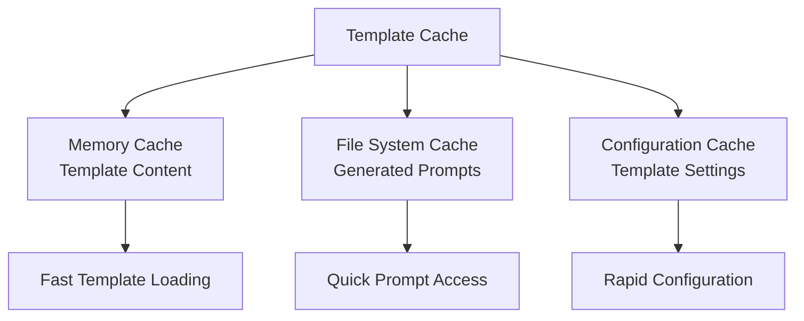

### Async Processing

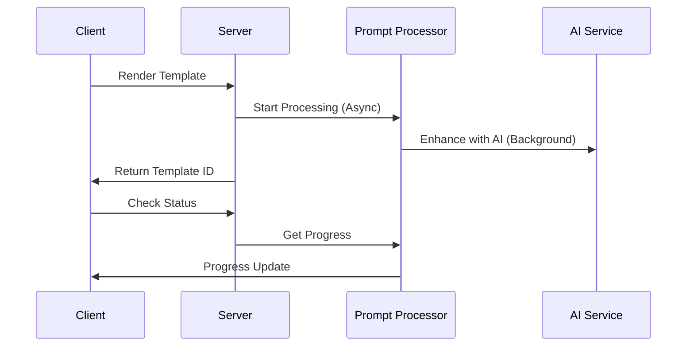

## 🚀 Deployment Architecture

### Development Setup

```mermaid
graph TD
    A[Local Development] --> B[Python Environment]
    B --> C[FastAPI Server]
    C --> D[Template Files]
    D --> E[Data Store]
    E --> F[Client Interface]

    C --> G[AI Integration<br/>(Optional)]
    G --> H[OpenAI/Anthropic<br/>API Integration]
```

### Production Deployment

```mermaid
graph TD
    A[Production Server] --> B[Docker Container]
    B --> C[FastAPI Application]
    C --> D[Volume Mounts<br/>Templates & Data]
    D --> E[Persistent Storage]
    E --> F[Prompt Processing]

    A --> G[Load Balancer<br/>(Optional)]
    G --> H[Multiple Instances]
    H --> I[High Availability]
```

## 📊 Monitoring & Observability

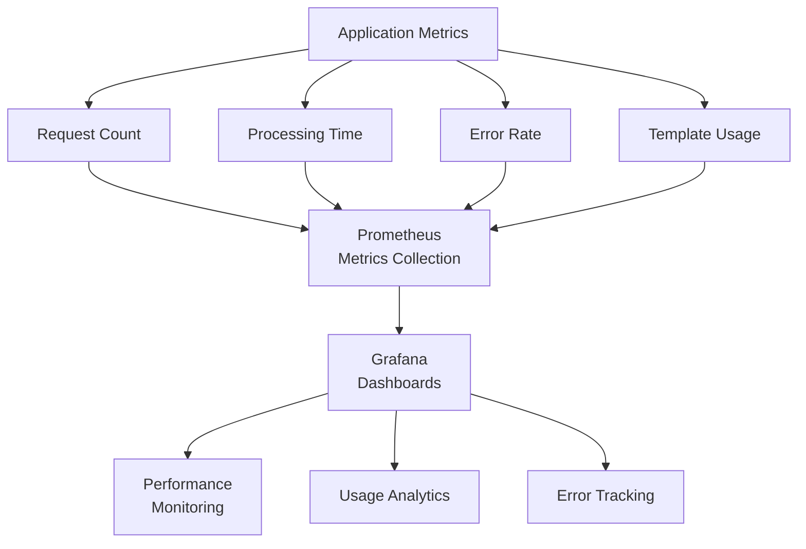

## 🔧 Configuration Management

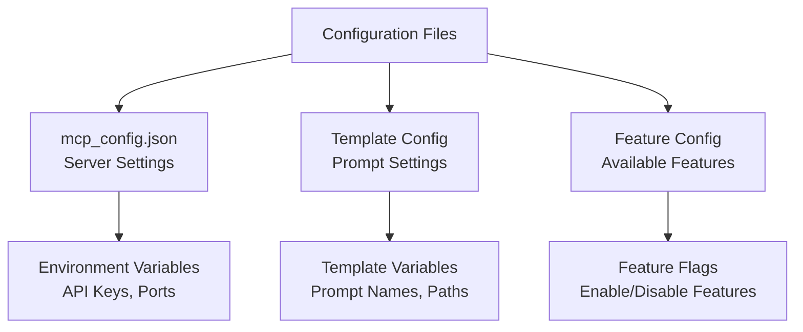

## 📚 Documentation Structure

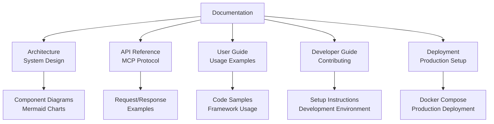

## 🎯 Key Benefits

### For Developers

- **Rapid Prompt Creation**: Generate standardized prompt templates in seconds
- **Best Practices**: Built-in prompt engineering best practices and patterns
- **Template Categories**: Choose the right template category for your needs
- **Feature Rich**: Integrated AI enhancement and variable substitution

### For Organizations

- **Standardization**: Consistent prompt templates across teams
- **Accelerated Development**: Faster prompt creation for AI workflows
- **Quality Assurance**: Built-in validation, testing, and monitoring
- **Scalability**: Support for multiple AI models and integrations

### For AI Assistants

- **MCP Integration**: Seamless integration with Claude, Cursor, etc.
- **Context Awareness**: Full prompt context for intelligent assistance
- **Template Management**: Standardized prompt templates with AI enhancement
- **Workflow Optimization**: Track and manage prompt usage and effectiveness

## 🚀 Future Enhancements

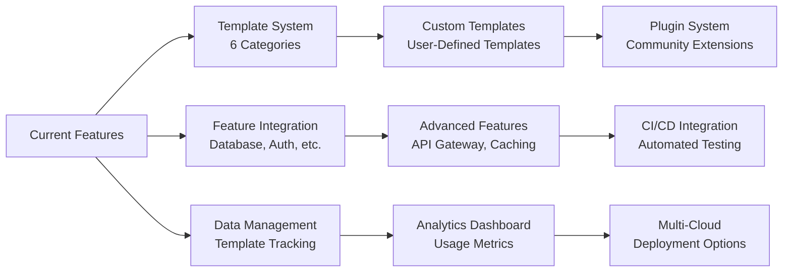

This architecture provides a solid foundation for AI-powered prompt template generation while maintaining flexibility for future enhancements and customizations.
