# 🏗️ Component Structure: FastAPI MCP Server Architecture

## 📋 Overview

This document provides a comprehensive view of the FastAPI-based MCP server's component architecture, highlighting key interactions and dependencies between different parts of the system.

## 🎯 System Component Overview with Repository/Service Architecture

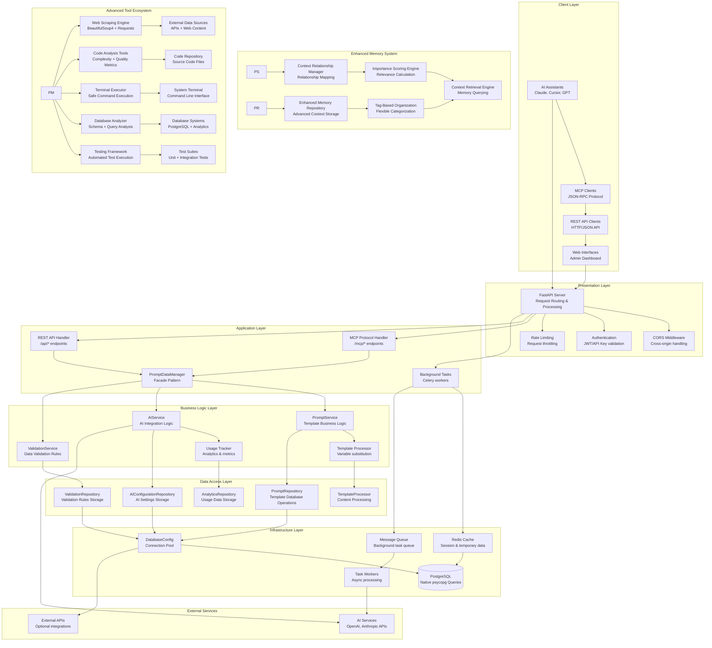

## 🔧 Detailed Component Architecture

### 1. FastAPI Application Server (Presentation Layer)

**Primary Responsibilities:**

- HTTP request handling and routing
- Middleware management and processing
- Response generation and formatting
- Background task scheduling
- Integration with application layer

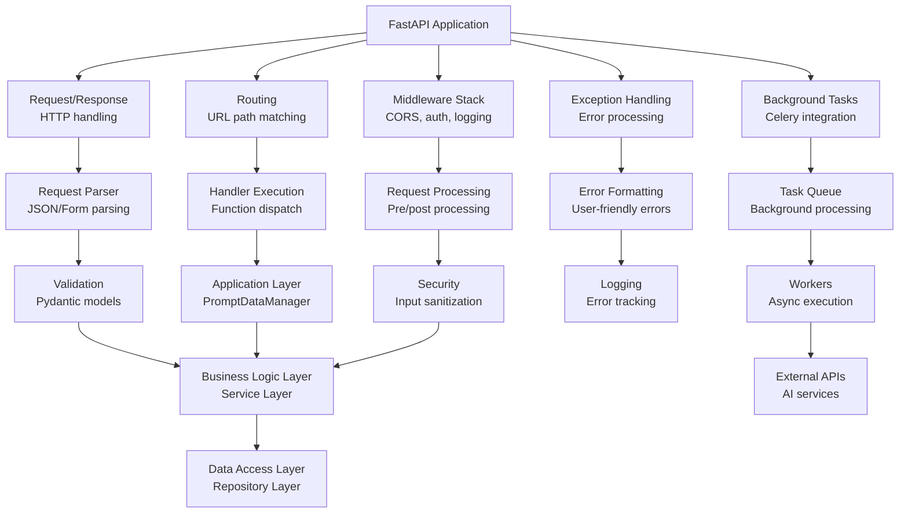

### 2. Application Layer (PromptDataManager Facade)

**Primary Responsibilities:**

- Main entry point for all data operations
- Orchestrates service and repository layers
- Manages global state and configuration
- Implements facade pattern for simplified interface

```python
class PromptDataManager:
    """Facade pattern implementation for data management"""

    def __init__(self):
        self.prompt_service = BusinessLogicPromptService()
        self.ai_service = AIService()
        self.db_manager = DatabaseManager()

    def render_template(self, template_name: str, variables: Dict[str, Any]) -> str:
        """Main template rendering method using layered architecture"""
        # Service layer handles business logic
        template = self.prompt_service.get_template(template_name)
        # Repository layer handles data access
        db_template = self.prompt_service.repository.get_by_name(template_name)
        # Process and return
        return template.render(variables)
```

### 3. Business Logic Layer (Service Layer)

**Primary Responsibilities:**

- Implement business logic and use cases
- Handle validation and business rules
- Orchestrate repository operations
- Provide transaction boundaries

**Key Components:**

- **PromptService**: Template business logic and validation
- **AIService**: AI configuration and integration logic
- **ValidationService**: Data validation utilities
- **Business Rules**: Domain-specific logic and constraints

### 4. Data Access Layer (Repository Layer)

**Primary Responsibilities:**

- Abstract database operations from business logic
- Provide consistent data access interface
- Handle database-specific optimizations
- Implement data mapping and transformation

**Key Components:**

- **PromptTemplateRepository**: Template database operations
- **AIConfigurationRepository**: AI model configuration storage
- **BaseRepository**: Generic CRUD operations for all entities
- **DatabaseConfig**: Connection pooling and transaction management

### 5. MCP Protocol Handler

**Primary Responsibilities:**

- JSON-RPC 2.0 protocol implementation
- MCP method routing and execution
- Response formatting according to MCP spec
- Error handling for protocol violations

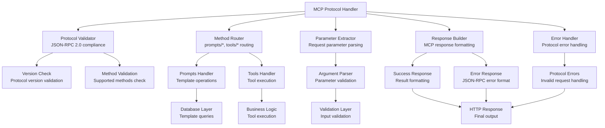

### 3. Data Management Layer

**Primary Responsibilities:**

- Database connection management
- ORM operations and query building
- Transaction handling and rollbacks
- Connection pooling and optimization

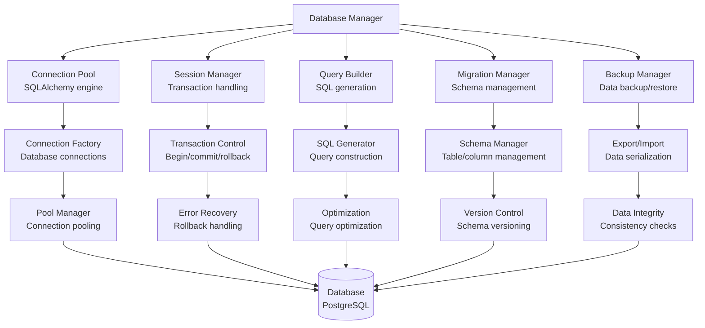

### 4. Prompt Template Manager

**Primary Responsibilities:**

- Template CRUD operations
- Variable substitution and rendering
- Template validation and processing
- Usage tracking and analytics

```mermaid
graph TD
    A[Prompt Manager] --> B[Template CRUD<br/>Create/read/update/delete]
    A --> C[Variable Processor<br/>{{variable}} substitution]
    A --> D[Validator<br/>Template content validation]
    A --> E[Cache Manager<br/>Template caching]
    A --> F[Usage Tracker<br/>Analytics collection]

    B --> G[Database Layer<br/>SQLAlchemy operations]
    C --> H[Substitution Engine<br/>String replacement]
    D --> I[Syntax Checker<br/>Template validation]
    E --> J[Cache Layer<br/>Redis/in-memory cache]
    F --> K[Metrics Collector<br/>Usage statistics]

    G --> L[Transaction Manager<br/>Atomic operations]
    H --> M[Output Formatter<br/>Clean content]
    I --> N[Error Reporter<br/>Validation errors]
    J --> O[Cache Invalidation<br/>Update management]
    K --> P[Analytics Database<br/>Usage data storage]

    L --> Q[(Database<br/>Template storage)]
    M --> R[Response Builder<br/>Formatted output]
    N --> S[Error Handler<br/>Validation failures]
    O --> T[Cache Refresh<br/>Background updates]
    P --> U[Reporting System<br/>Usage reports]
```

### 5. AI Integration Layer

**Primary Responsibilities:**

- External AI service communication
- Request/response handling
- Rate limiting and quota management
- Fallback and error handling

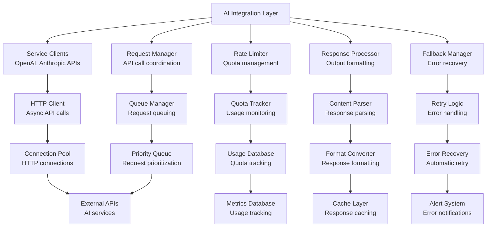

## 🔄 Component Interaction Patterns

### Request-Response Flow

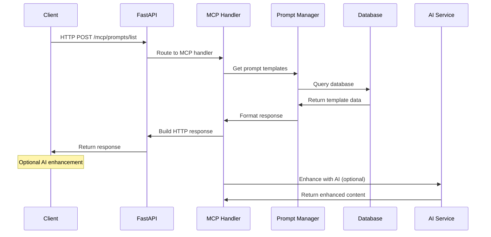

### Error Handling Flow

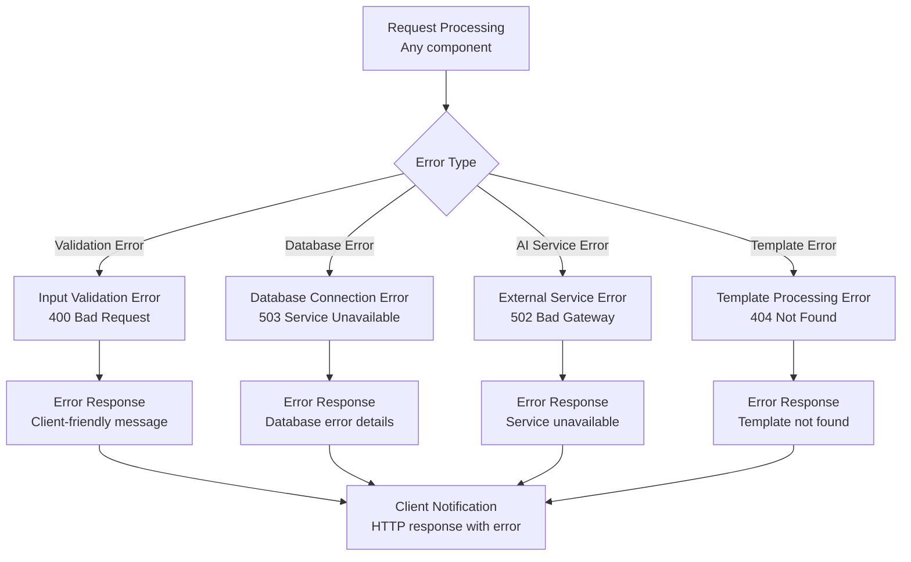

### Data Flow Between Components

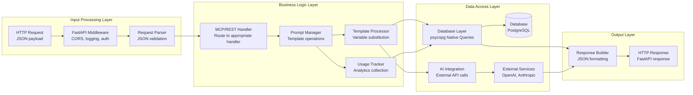

## 📊 Component Dependencies

### Internal Dependencies

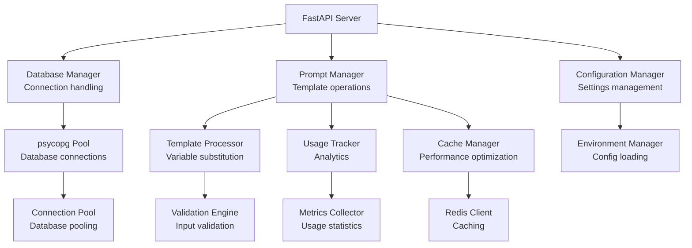

### External Dependencies

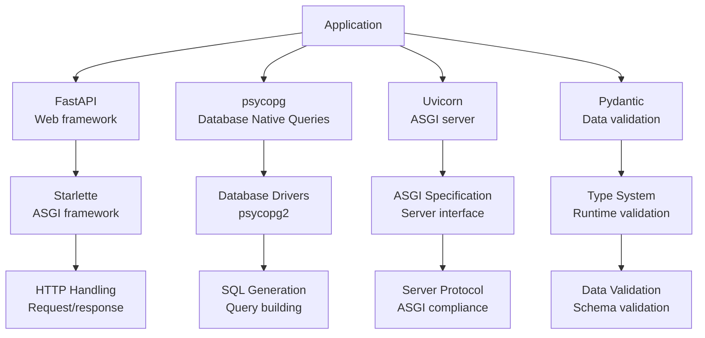

## 🔧 Configuration Management

### Configuration Component Architecture

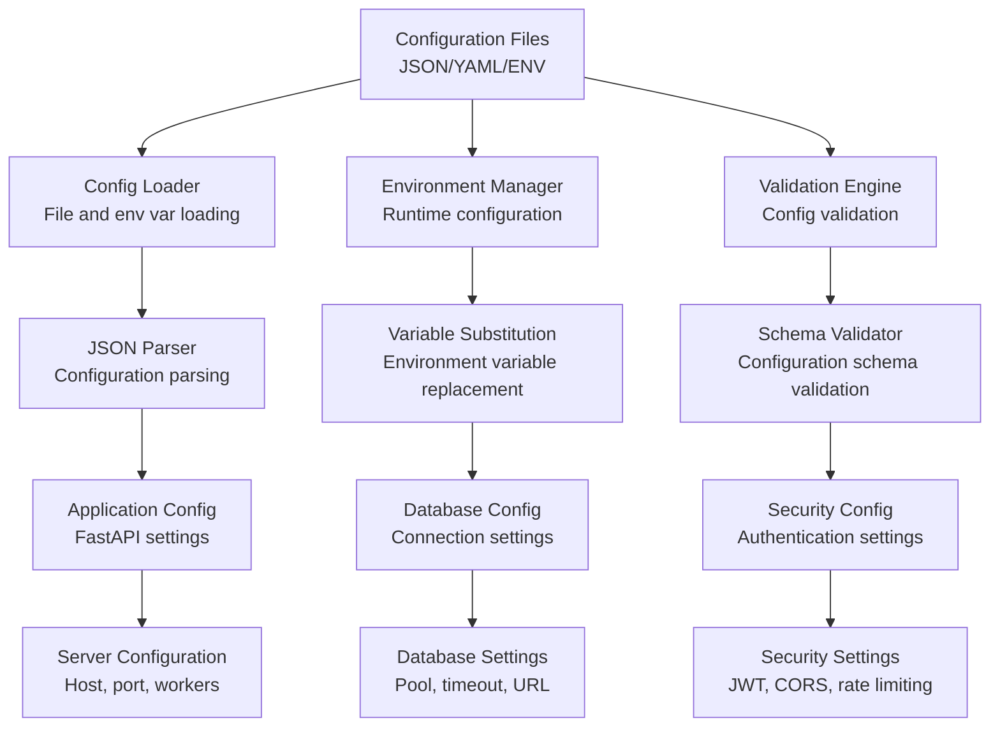

### Settings Hierarchy

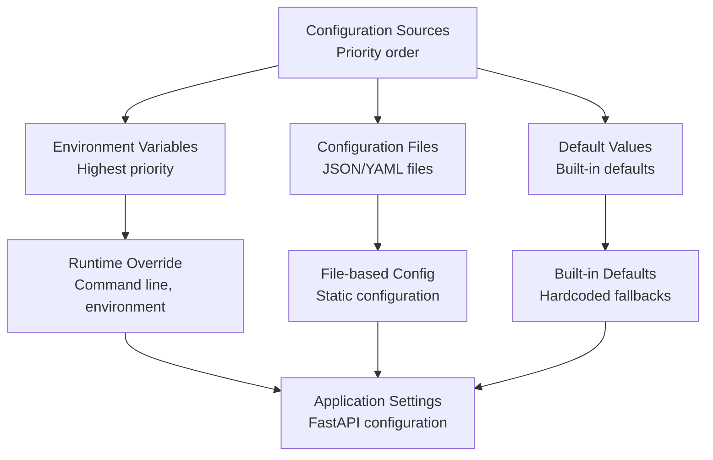

## 📈 Performance Components

### Caching System Architecture

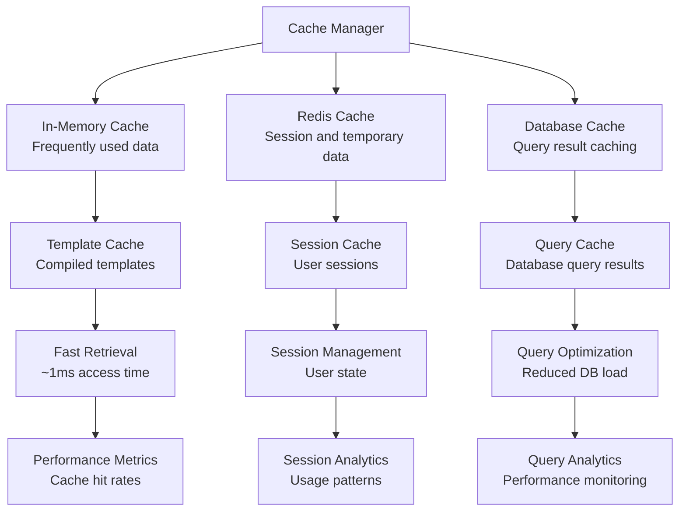

### Async Processing Architecture

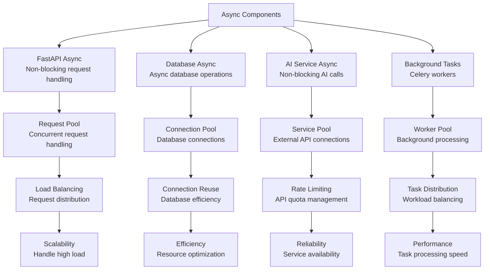

## 🧪 Testing Component Architecture

### Test Coverage Areas

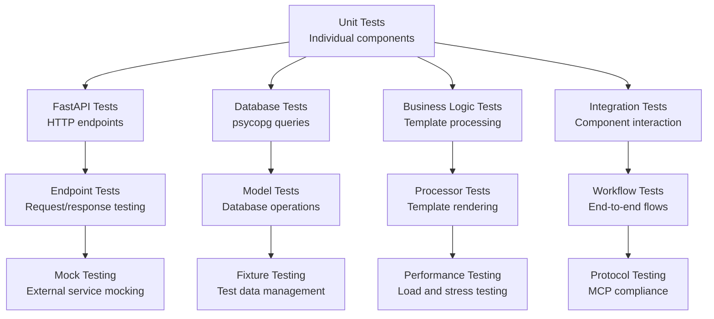

### Testing Infrastructure

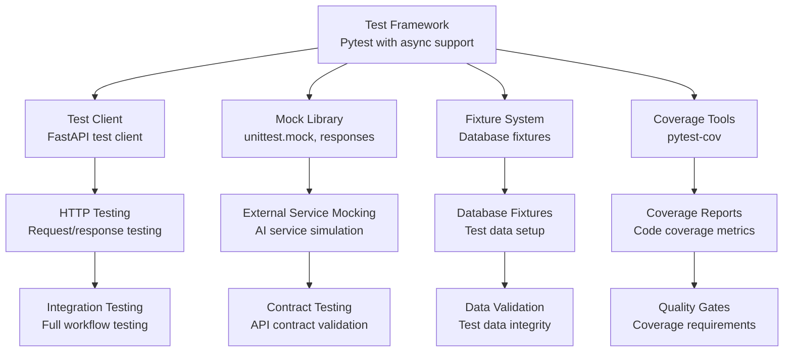

## 📚 Documentation Components

### Documentation Structure

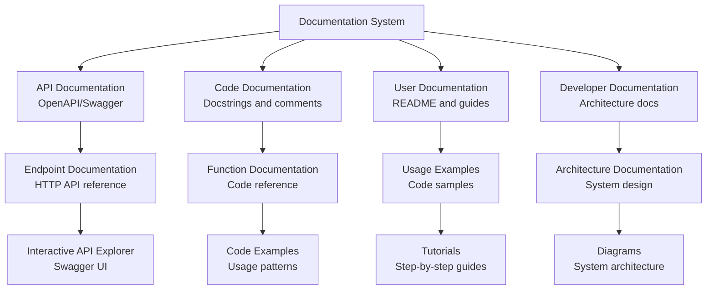

This comprehensive component architecture ensures the FastAPI MCP server is well-structured, maintainable, and provides clear separation of concerns for different aspects of the prompt engineering functionality.
