# 🔄 Flow Control: Request Processing Analysis

## 📋 Overview

This document provides a comprehensive analysis of the FastAPI-based MCP server's request processing flow, from initial client request through prompt template resolution to final response generation.

## 🎯 Request Processing Architecture

### HTTP Request Lifecycle with Layered Architecture

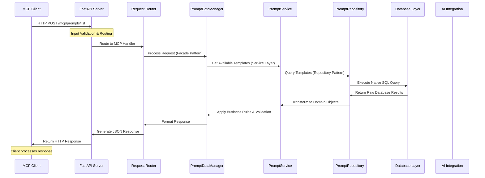

### Detailed Request Flow Components with Layered Architecture

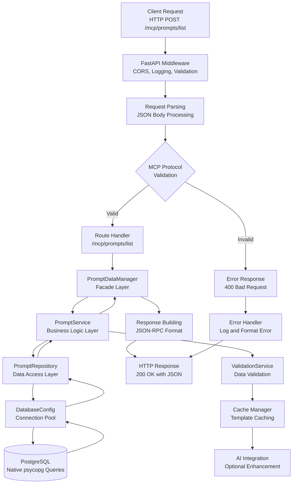

## 🔍 Detailed Flow Analysis

### 1. Client Request Initiation

**Endpoint**: `POST /mcp/prompts/list`

```mermaid
flowchart TD
    A[AI Assistant<br/>Claude/Cursor] --> B[Generate JSON-RPC Request<br/>{"jsonrpc": "2.0", "id": "123", "method": "prompts/list"}]
    B --> C[HTTP Client<br/>Send POST Request]
    C --> D[Network Layer<br/>TCP/IP Transport]
    D --> E[FastAPI Server<br/>Receive Request]

    E --> F[Request Context<br/>URL, Headers, Body]
    F --> G[Middleware Stack<br/>CORS, Logging, Security]
    G --> H[Route Matching<br/>Match /mcp/prompts/list]
    H --> I[Handler Execution<br/>list_prompts() Function]
```

**Data Flow:**

- **Input**: JSON-RPC 2.0 formatted request
- **Validation**: Protocol version, method name, parameters
- **Routing**: FastAPI automatic route resolution
- **Processing**: Template retrieval and formatting

### 2. Server Request Processing with Layered Architecture

**Request Handler**: `list_prompts()` - Uses Repository/Service Pattern

```mermaid
flowchart TD
    A[Handler Start<br/>async def list_prompts(request: Dict) -> Dict] --> B[Input Validation<br/>Check JSON-RPC Format]
    B --> C[PromptDataManager.get_data_manager()<br/>Get Facade Instance]
    C --> D[PromptService.list_templates()<br/>Business Logic Call]
    D --> E[PromptRepository.find_active_templates()<br/>Repository Query]
    E --> F[DatabaseConfig.get_connection()<br/>Connection Pool Access]
    F --> G[psycopg Native Query<br/>SELECT * FROM prompt_templates WHERE is_active=True]
    G --> H[Result Processing<br/>Transform Raw Data to Objects]
    H --> I[Service Layer Validation<br/>Business Rules Applied]
    I --> J[Response Building<br/>JSON-RPC Success Response]
    J --> K[Session Cleanup<br/>Connection Pool Return]
    K --> L[Return Response<br/>FastAPI HTTP Response]

    B --> M[Error: Invalid Request<br/>400 Bad Request]
    M --> N[Error Response<br/>JSON-RPC Error Format]
    N --> L
```

**Repository Layer Query**:

```sql
-- Repository executes optimized native queries
SELECT
    id, name, description, category, variables,
    created_at, updated_at
FROM prompt_templates
WHERE is_active = true
ORDER BY category, name
```

**Service Layer Processing**:

```python
# Service layer adds business logic
def list_templates(self) -> List[PromptTemplate]:
    # Get from repository
    templates = self.repository.find_active_templates()

    # Apply business rules
    for template in templates:
        template.validate_category()
        template.sanitize_content()

    # Return processed templates
    return templates
```

### 3. Template Processing Pipeline with Repository/Service Layers

**Template Resolution Flow**:

```mermaid
flowchart TD
    A[Template Request<br/>Template Name + Variables] --> B[Service Layer<br/>Input Validation & Business Rules]
    B --> C[Repository Layer<br/>Database Query & Object Mapping]
    C --> D{Template Found}
    D -->|Yes| E[Domain Model Creation<br/>Transform DB Row to Object]
    D -->|No| F[Repository Exception<br/>TemplateNotFoundError]

    E --> G[Service Layer Processing<br/>Business Logic & Validation]
    G --> H[Variable Processing<br/>Parse Template Variables]
    H --> I[Content Rendering<br/>Replace {{variables}} with Values]
    I --> J[AI Enhancement<br/>Optional GPT/Claude Integration]
    J --> K[Output Formatting<br/>Clean and Structure Response]
    K --> L[Success Response<br/>Rendered Template Content]

    F --> M[Service Exception Handling<br/>404 Not Found with Details]
    M --> L

    G --> N[Validation Service<br/>Data Validation & Sanitization]
    N --> O[Cache Manager<br/>Template Caching for Performance]
```

### 4. Database/Data Management Flow with Repository Pattern

**Repository Layer Query Flow**:

```mermaid
flowchart TD
    A[Service Request<br/>Business Operation] --> B[Repository Layer<br/>Data Access Interface]
    B --> C[Connection Pool<br/>DatabaseConfig.get_connection_pool()]
    C --> D[Native SQL Query<br/>Repository builds optimized queries]
    D --> E[Parameter Binding<br/>Safe SQL injection prevention]
    E --> F[Query Execution<br/>psycopg native query execution]
    F --> G[Result Processing<br/>Transform raw data to domain objects]
    G --> H[Connection Pool<br/>Return Connection to Pool]
    H --> I[Repository Response<br/>Domain objects returned to service]

    D --> J[Error Handling<br/>Database exceptions caught]
    J --> K[Repository Exception<br/>Transform to business exceptions]
    K --> L[Service Error Handling<br/>Business logic error handling]
    L --> M[Error Response<br/>User-friendly error messages]
```

**Repository Pattern Benefits**:

- **Separation of Concerns**: Database logic isolated from business logic
- **Testability**: Easy to mock repository for unit testing
- **Consistency**: Standardized data access patterns
- **Performance**: Optimized queries and connection pooling
- **Maintainability**: Changes to database schema isolated to repository layer

**Connection Pool Management**:

- **Pool Size**: Configurable based on load requirements (min_size: 5, max_size: 20)
- **Overflow Protection**: Additional connections beyond pool size
- **Timeout Handling**: Connection acquisition timeout (30 seconds)
- **Connection Recycling**: Automatic connection refresh to prevent stale connections
- **Thread Safety**: Thread-safe connection pool access

## 📊 Data Lineage Analysis

### Example: `template_name` Variable Flow

**Variable**: `template_name`
**Context**: Prompt template rendering request

```mermaid
flowchart LR
    subgraph "Input Stage"
        A[HTTP Request<br/>template_name="business_logic"] --> B[URL Parsing<br/>Extract from Query String]
        B --> C[Validation<br/>Check Template Exists]
    end

    subgraph "Processing Stage"
        C --> D[Database Query<br/>SELECT * FROM prompt_templates WHERE name=%s]
        D --> E[Template Loading<br/>Load Template Content]
        E --> F[Variable Substitution<br/>Replace {{variables}} in Content]
    end

    subgraph "Output Stage"
        F --> G[Response Building<br/>Format JSON Response]
        G --> H[HTTP Response<br/>Return Rendered Content]
    end
```

**Transformation Points:**

1. **Input Sanitization**: URL decode and validate template name
2. **Database Query**: Convert name to SQL WHERE clause
3. **Template Processing**: Replace `{{variable}}` placeholders with actual values
4. **Response Formatting**: Structure data for JSON response

### Example: `prompt_variables` Variable Flow

**Variable**: `prompt_variables`
**Context**: Template rendering with multiple variables

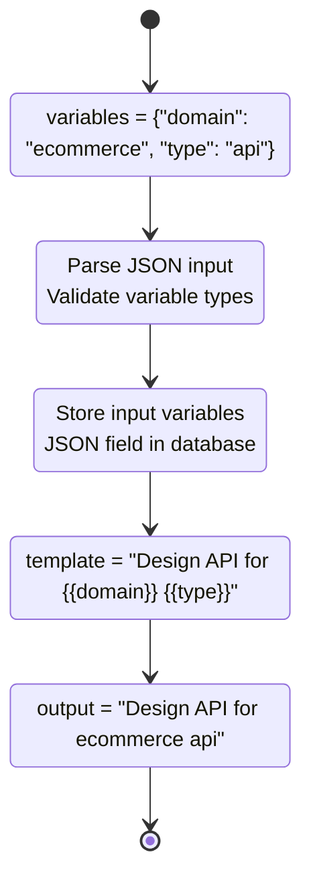

## 🔧 Control Flow Branching

### MCP Protocol vs REST API Routing

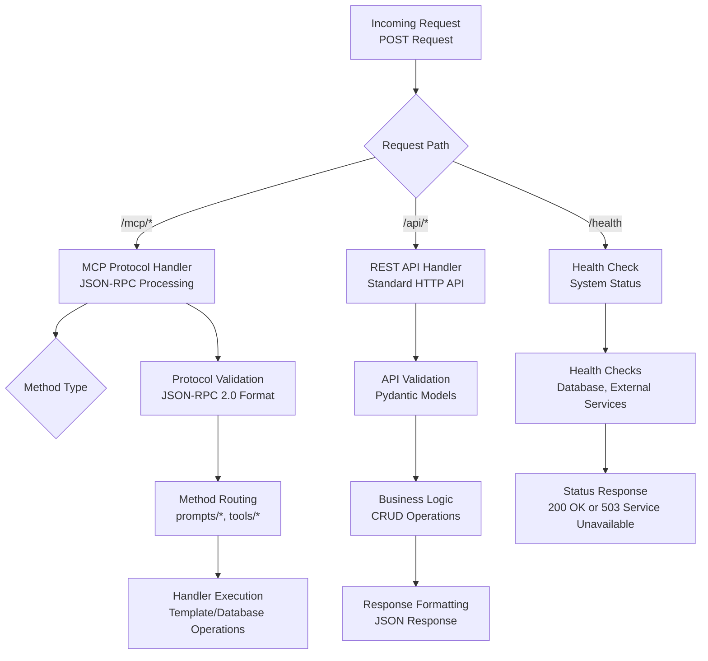

### Error Handling Flow

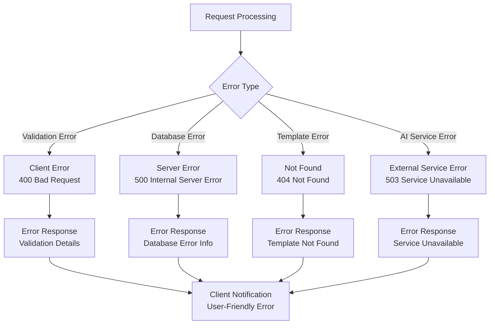

## 📈 Performance Control Flow

### Caching Strategy Flow

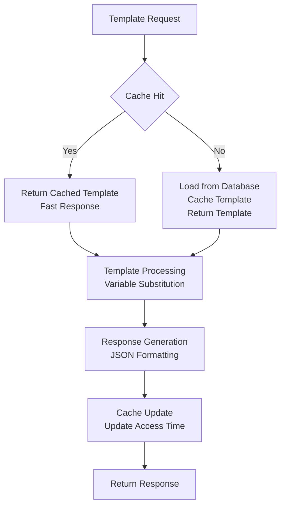

**Cache Invalidation**:

- **Time-based**: TTL expiration
- **Event-based**: Template updates trigger cache refresh
- **Manual**: Admin cache purge endpoints

### Async Processing Flow

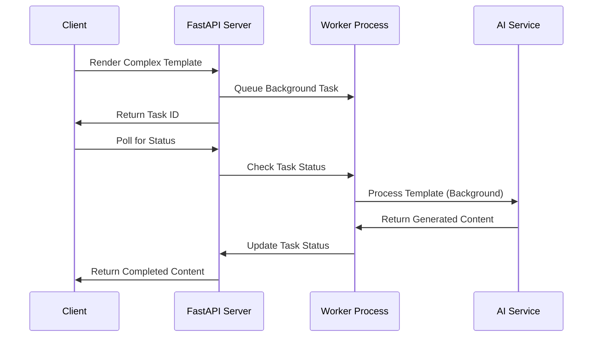

## 🎯 Critical Path Analysis

### Fastest Path: Simple Template Listing

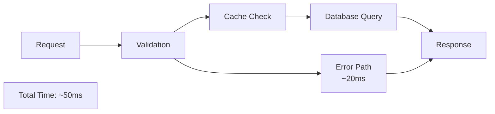

**Optimization Points:**

- **Cache Hit Rate**: 90%+ for frequently accessed templates
- **Database Indexing**: Optimized queries on template name/category
- **Connection Pooling**: Pre-warmed database connections

### Slowest Path: Complex Template with AI Processing

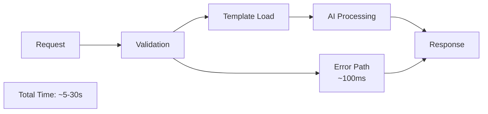

**Optimization Strategies:**

- **Background Processing**: Move AI calls to async workers
- **Response Streaming**: Stream partial results as available
- **Caching**: Cache common AI responses
- **Rate Limiting**: Prevent AI service overload

## 📊 Monitoring Points

### Metrics Collection Flow

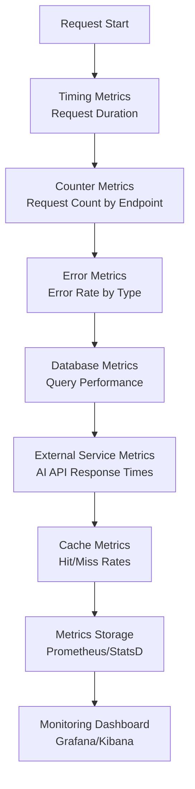

### Health Check Flow

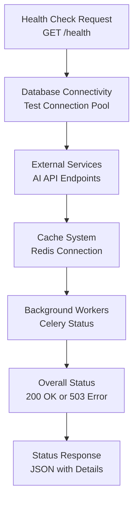

## 🔐 Security Control Flow

### Input Validation Pipeline

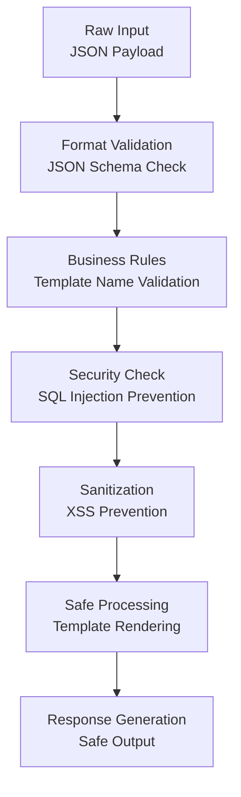

### Authentication Flow

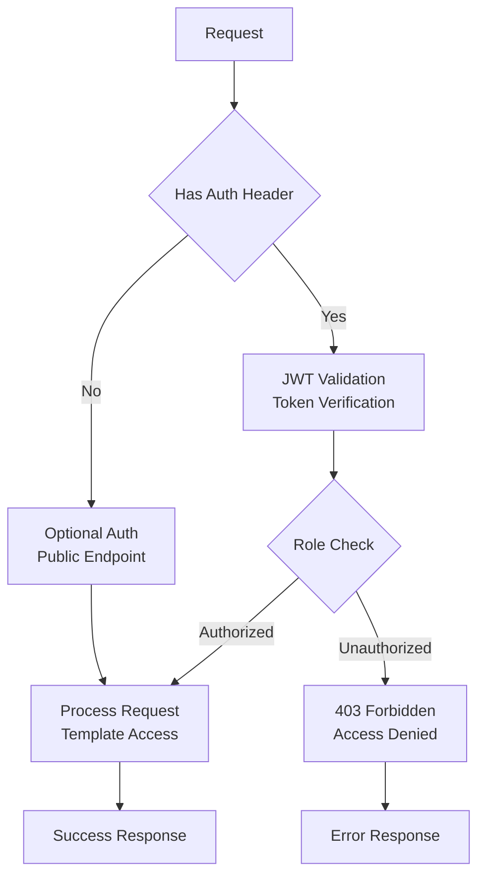

This comprehensive flow control analysis ensures developers understand exactly how requests are processed, where performance bottlenecks may occur, and how the system maintains security and reliability throughout the entire request lifecycle.
