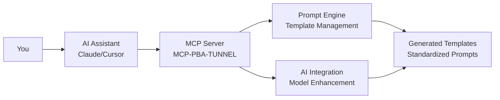

# 👥 User Guide: Getting Started for New Developers

## 🎯 Welcome to MCP-PBA-TUNNEL

Hello, new developer! 👋 This guide will walk you through everything you need to know to get started with the MCP-PBA-TUNNEL. Whether you're here to manage prompt templates, contribute to the codebase, or understand how it works, this guide has you covered.

## 🚀 Quick Start (5 Minutes)

### Step 1: Setup Your Environment

```bash
# 1. Navigate to the project directory
cd /path/to/mcp-pba-tunnel

# 2. Create a virtual environment (recommended)
python3 -m venv venv
source venv/bin/activate

# 3. Install dependencies
pip install -r requirements.txt

# 4. Quick test to make sure everything works
python3 -c "from mcp_pba_tunnel.server.fastapi_mcp_server import app; print('✅ System is ready!')"
```

### Step 2: Start the MCP Server

```bash
# Start the MCP server
python3 -m mcp_pba_tunnel.server.fastapi_mcp_server
```

You should see output like:

```
MCP-PBA-TUNNEL FastAPI Server initialized
Available categories: ['development', 'architecture', 'data', 'quality', 'communication', 'techniques']
```

### Step 3: Test Your First Template

```bash
# List available prompt categories
curl http://localhost:9001/api/categories

# List available prompt templates
curl -X POST http://localhost:9001/mcp/prompts/list -H "Content-Type: application/json"

# Test a template rendering
curl -X POST http://localhost:9001/api/prompts/business_logic/render -H "Content-Type: application/json" -d '{"variables": {"business_domain": "ecommerce"}}'
```

That's it! You now have a working prompt template system ready to use.

## 📚 Understanding the System

### What is MCP-PBA-TUNNEL?

**MCP** = Model Context Protocol

- A system that lets AI assistants manage standardized prompt templates through conversation
- You can say "Create a business logic template for e-commerce" and get an optimized prompt template

**Key Features:**

- 🤖 **AI-Powered**: Works with AI assistants seamlessly
- 🏗️ **Multi-Category**: Development, Architecture, Data, Quality, Communication templates
- 🔧 **Feature Rich**: AI enhancement, variable substitution, usage tracking
- ⚡ **Instant**: Generate prompt templates in seconds
- 🎯 **Customizable**: Extensive configuration options

### How It Works



## 🛠️ Usage Examples

### Basic Template Management

```bash
# List available prompt categories
curl http://localhost:9001/api/categories

# List available prompt templates
curl -X POST http://localhost:9001/mcp/prompts/list -H "Content-Type: application/json"

# Render a business logic template
curl -X POST http://localhost:9001/api/prompts/business_logic/render \
  -H "Content-Type: application/json" \
  -d '{"variables": {"domain": "e-commerce", "type": "API design"}}'

# Get template usage statistics
curl http://localhost:9001/api/stats
```

### Available Template Categories

| Category | Best For | Example Use Case |
|----------|----------|------------------|
| **Development** | Business logic, API design | E-commerce workflows, user management |
| **Architecture** | System design, patterns | Microservices design, API gateways |
| **Data** | Database schemas, modeling | Data structures, psycopg queries |
| **Quality** | Testing strategies, reviews | Code quality, testing frameworks |
| **Communication** | Documentation, presentations | Technical docs, stakeholder communication |

### Template Features

```bash
# Templates include these capabilities
# - Variable substitution with {{variable}} syntax
# - AI enhancement for content optimization
# - Usage tracking and analytics
# - Category-based organization
# - Validation and quality checks
```

| Feature | What It Provides | When to Use |
|---------|------------------|-------------|
| **Variable Substitution** | Dynamic content replacement | When templates need customization |
| **AI Enhancement** | GPT/Claude content optimization | When you want AI-improved prompts |
| **Usage Tracking** | Analytics and statistics | For monitoring template effectiveness |
| **Category Organization** | Structured template management | For team standardization |
| **Validation** | Input and content validation | For quality assurance |

## 📁 System Structure Explained

### MCP-PBA-TUNNEL Layout

Here's the structure of the MCP-PBA-TUNNEL system with the new repository and service layer architecture:

```
mcp-pba-tunnel/
├── server/                    # FastAPI MCP server
│   └── fastapi_mcp_server.py
├── data/                      # Data management layer (refactored)
│   ├── models/               # Pydantic data models and DTOs
│   │   ├── prompt_models.py  # Prompt template models
│   │   ├── ai_models.py      # AI configuration models
│   │   └── chain_models.py   # Prompt chain models
│   ├── repositories/         # Repository layer (database operations)
│   │   ├── database.py       # Connection pooling & transactions
│   │   ├── base.py           # Base repository with CRUD operations
│   │   ├── prompt_repository.py # Prompt template database operations
│   │   └── ai_repository.py  # AI configuration database operations
│   ├── services/             # Service layer (business logic)
│   │   ├── prompt_service.py # Prompt template business logic
│   │   └── ai_service.py     # AI configuration business logic
│   ├── validation.py         # Data validation utilities
│   └── project_manager.py    # Main facade using repository/service patterns
├── config/                    # Configuration files
│   └── mcp_config.json
├── mcp/                       # MCP protocol configuration
│   └── mcp_config.json
├── documents/                 # Documentation
├── tests/                     # Test files
└── templates/                 # Prompt template examples
```

### Understanding the System Components

**server/fastapi_mcp_server.py** - The main FastAPI application:

```python
# Health check endpoint
@app.get("/health")
async def health_check():
    return {"status": "healthy", "service": "mcp-pba-tunnel"}

# MCP prompt listing using refactored architecture
@app.post("/mcp/prompts/list")
async def list_prompts(request: dict):
    data_manager = get_data_manager()
    templates = data_manager.prompt_manager.list_prompt_templates()
    return {"templates": templates}
```

**data/project_manager.py** - Main facade using repository/service patterns:

```python
# Refactored to use repository and service layers
def get_data_manager():
    """Get global data manager instance using clean architecture"""
    global _data_manager
    if _data_manager is None:
        _data_manager = PromptDataManager()
    return _data_manager

class PromptDataManager:
    """Main data manager using repository and service patterns"""
    def __init__(self):
        self.db_manager = DatabaseManager()
        self.prompt_service = BusinessLogicPromptService()
        self.ai_service = AIService()
```

**data/models/** - Pydantic data models and DTOs:

```python
# Base models for type safety and validation
class PromptTemplateBase(BaseModel):
    name: str
    description: str
    category: str
    template_content: str
    variables: List[str]

class PromptTemplateCreate(PromptTemplateBase):
    """DTO for creating prompt templates"""
    pass

class PromptTemplateUpdate(BaseModel):
    """DTO for updating prompt templates"""
    name: Optional[str] = None
    description: Optional[str] = None
    # ... other fields
```

**data/repositories/** - Database operations layer:

```python
# Repository pattern for database operations
class PromptTemplateRepository(BaseRepository[PromptTemplate]):
    def create(self, template: PromptTemplate) -> str:
        query = """
        INSERT INTO prompt_templates (
            id, name, description, category, template_content, variables
        ) VALUES (%s, %s, %s, %s, %s, %s)
        """
        params = (str(template.id), template.name, template.description,
                 template.category, template.template_content,
                 json.dumps(template.variables))
        return DatabaseOperations.execute_query(query, params)

    def get_by_name(self, name: str) -> Optional[PromptTemplate]:
        query = "SELECT * FROM prompt_templates WHERE name = %s"
        result = DatabaseOperations.execute_query(query, (name,), fetch="one")
        return PromptTemplate(**result) if result else None
```

**data/services/** - Business logic layer:

```python
# Service layer for business logic operations
class PromptService:
    def __init__(self):
        self.template_repository = PromptTemplateRepository()
        self.usage_repository = PromptUsageRepository()
        self.content_repository = GeneratedContentRepository()

    def create_template(self, template_data: Dict[str, Any]) -> PromptTemplate:
        # Validate input data
        errors = DataValidator.validate_prompt_template_data(template_data)
        if errors:
            raise ValidationError(f"Invalid template data: {errors}")

        # Create template object
        template = PromptTemplateCreate(**template_data)

        # Save to database
        template_id = self.template_repository.create(template)

        return template
```

**config/mcp_config.json** - System configuration:

```json
{
  "server": {
    "name": "mcp-pba-tunnel",
    "protocol": "mcp-2024-11-05"
  },
  "ai": {
    "default_model": "gpt-4",
    "max_tokens": 4000
  },
  "database": {
    "pool_min_size": 5,
    "pool_max_size": 20,
    "timeout": 30
  }
}
```

## 🔧 Configuration & Customization

### Server Configuration

Edit `config/mcp_config.json` to customize:

```json
{
  "server": {
    "name": "mcp-pba-tunnel",
    "version": "1.0.0"
  },
  "categories": {
    "development": {
      "name": "Development",
      "description": "Business logic and API design templates"
    }
  }
}
```

### Adding Custom Templates

1. Create a new directory in `templates/`:

```bash
mkdir templates/custom-category
```

2. Add your template files:

```
templates/custom-category/
├── prompt_template.md
├── config.json
└── README.md
```

3. Update the configuration to include your category.

## 🐛 Troubleshooting

### Common Issues

**1. "Python module not found"**

```bash
# Make sure you're in the virtual environment
source venv/bin/activate
pip install -r requirements.txt
```

**2. "Template category not found"**

```bash
# Check available prompt categories
curl http://localhost:9001/api/categories

# Supported categories: development, architecture, data, quality, communication, techniques
```

**3. "Database connection failed"**

```bash
# Check server health
curl http://localhost:9001/health

# Check database configuration in config/mcp_config.json
# Ensure psycopg is installed and connection pool is configured
# Verify database URL and credentials
# Run migrations: python -c "from mcp_pba_tunnel.data.project_manager import DatabaseManager; db = DatabaseManager(); db.run_migrations()"
```

**4. Template rendering failed**

```bash
# Check the template exists
curl http://localhost:9001/api/categories

# Check server health
curl http://localhost:9001/health

# Verify template variables are correct
curl -X POST http://localhost:9001/api/prompts/business_logic/render -H "Content-Type: application/json" -d '{"variables": {"domain": "ecommerce"}}'
```

### Getting Help

1. **Check the logs** - The server outputs helpful information
2. **Read the documentation** - See `docs/README.md` for detailed guides
3. **Examine examples** - Look at `templates/` for code examples
4. **Check configuration** - Verify `config/mcp_config.json`

## 🤝 Contributing

### Development Workflow

```bash
# 1. Fork and clone the repository
git clone https://github.com/your-username/mcp-pba-tunnel.git
cd mcp-pba-tunnel

# 2. Set up development environment
python3 -m venv venv
source venv/bin/activate
pip install -r requirements.txt

# 3. Make your changes
# Edit files in server/, templates/, etc.

# 4. Test your changes
python3 -c "from mcp_pba_tunnel.server.fastapi_mcp_server import app; print('✅ Changes work!')"

# 5. Run tests (if you add them)
pytest

# 6. Submit a pull request
```

### Code Style

- **Python**: Follow PEP 8, use type hints
- **Documentation**: Use docstrings, clear variable names
- **Error Handling**: Always handle exceptions gracefully
- **Testing**: Add tests for new functionality

## 📈 Advanced Usage

### MCP Integration

The system integrates with MCP-compatible clients:

```json
{
  "mcpServers": {
    "mcp-pba-tunnel": {
      "command": "python3",
      "args": ["/path/to/mcp-pba-tunnel/server/fastapi_mcp_server.py"],
      "cwd": "/path/to/mcp-pba-tunnel"
    }
  }
}
```

### Custom Features

Add new features by extending the generator:

```python
def _add_custom_feature_files(self, project_path: Path, feature: str):
    if feature == "custom-feature":
        # Add your custom files
        pass
```

### Analytics and Monitoring

The system tracks usage statistics:

```python
from mcp_pba_tunnel.data.project_manager import PromptDataManager

manager = PromptDataManager()
stats = manager.get_usage_statistics()
print(f"Template usage statistics: {len(stats)} templates")
```

## 🎯 Best Practices

### For New Templates

1. **Start Simple**: Begin with basic variables, add complexity as needed
2. **Use Categories Wisely**: Choose appropriate categories for your templates
3. **Test Everything**: Always test template rendering
4. **Document Well**: Good documentation helps other developers

### For Development

1. **Read the Architecture**: Understand how components interact
2. **Follow Patterns**: Use existing code as examples
3. **Test Changes**: Always test before committing
4. **Document Changes**: Update docs for new features

### For Production

1. **Security First**: Validate all inputs, sanitize paths
2. **Error Handling**: Graceful degradation on failures
3. **Monitoring**: Track performance and errors
4. **Backups**: Regular data backups of project records

## 📚 Learning Resources

### Documentation

- [Architecture Overview](architecture.md) - System design
- [Flow Control](flow-control.md) - Request processing
- [Data Lineage](data-lineage.md) - Variable tracing
- [Component Structure](component-structure.md) - System components

### Examples

- `templates/` - Framework-specific examples
- `docs/README.md` - Detailed usage guides
- `README.md` - Quick start guide

### Community

- GitHub Issues - Bug reports and feature requests
- Documentation - Always improving
- Examples - Community-contributed templates

## 🎉 You're Ready

You now know everything you need to get started with MCP-PBA-TUNNEL! Start by rendering your first prompt template, explore the codebase, and don't hesitate to contribute improvements.

**Happy coding! 🚀**

---

**Quick Reference:**

- Start server: `python3 server/fastapi_mcp_server.py`
- Check health: `curl http://localhost:9001/health`
- List categories: `curl http://localhost:9001/api/categories`
- Render prompt: `curl -X POST http://localhost:9001/api/prompts/business_logic/render -H "Content-Type: application/json" -d '{"business_domain": "e-commerce", "requirements": "User authentication"}'`
- Read docs: `README.md` and `documents/`

For questions or issues, check the troubleshooting section or create a GitHub issue.
